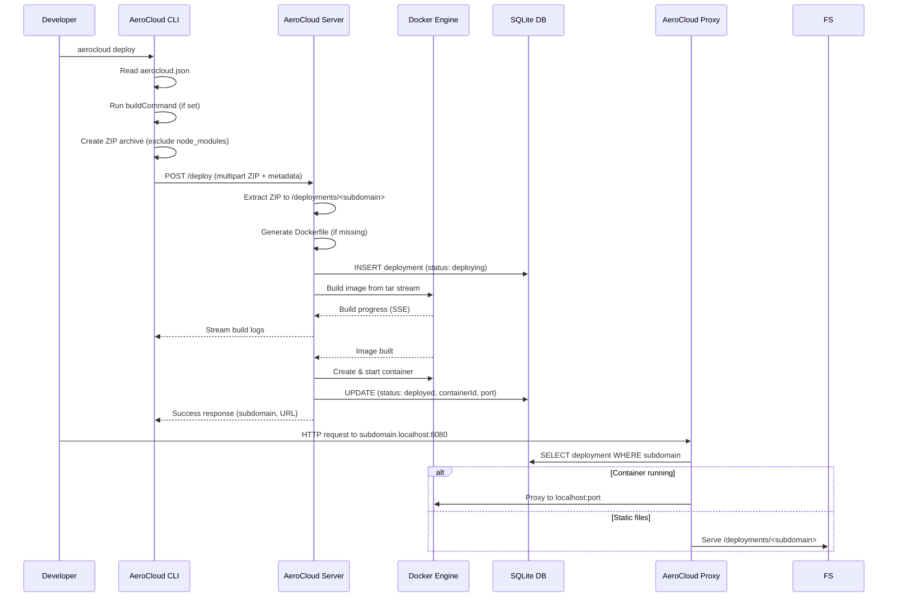

 AeroCloud

> **A minimalist, terminal-first developer Platform-as-a-Service (PaaS) engine built to run, sandbox, and route projects dynamically.**

---

## 🏛️ Project Overview & Vision

AeroCloud is a lightweight, self-hosted Platform-as-a-Service (PaaS) solution designed for developers who want to deploy and manage applications locally with the same ease as cloud platforms. It eliminates the complexity of container orchestration tools while providing a streamlined deployment experience directly from the terminal.

### Problem It Solves

- **Complex Deployment Workflows**: Traditional deployment requires Docker knowledge, Kubernetes configs, or cloud provider setup
- **Environment Inconsistency**: Differences between local development and production environments
- **Slow Iteration Cycles**: Long feedback loops when testing deployment configurations
- **Overhead of Full Orchestration**: Heavy tools like Kubernetes are excessive for local/small-scale deployments

### Long-term Vision

AeroCloud aims to become the **developer-first local PaaS** that bridges the gap between local development and production deployment. Future goals include:
- Multi-container application support with service discovery
- Built-in CI/CD pipeline integration
- Plugin system for custom deployment targets
- Team collaboration features for shared development environments
- Production deployment synchronization

---

## ✨ Core Features

### 🚀 **Zero-Config Deployment**
Deploy any Node.js/TypeScript project with a single command. Auto-detects project type and generates optimized Dockerfiles.

### 🏗️ **Automatic Dockerfile Generation**
Intelligently creates production-ready Dockerfiles for projects lacking one, following Node.js best practices (multi-stage builds, layer caching, security).

### 🔄 **Real-time Build Streaming**
Live Docker build logs streamed directly to your terminal during deployment for immediate feedback.

### 🌐 **Dynamic Subdomain Routing**
Each deployment gets a unique subdomain (e.g., `a1b2c3.localhost:8080`) with automatic HTTP proxy routing.

### 📦 **Smart Archiving**
Efficiently packages projects excluding `node_modules`, `dist`, and build artifacts with maximum compression.

### ⚙️ **Configuration-Driven**
Simple `aerocloud.json` configuration for custom subdomains, build commands, and publish directories.

### 📋 **Deployment Management**
List, inspect, and destroy deployments via CLI commands.

### 🐳 **Container Lifecycle Management**
Automatic container creation, port allocation, health checks, and cleanup.

---

## 🏗️ Architecture & How It Works

AeroCloud follows a **three-tier microservice architecture** communicating over local HTTP/Unix sockets:

```text
┌─────────────────┐     POST /deploy      ┌──────────────────┐
│  AeroCloud CLI  │ ────────────────────► │  AeroCloud Server│
│  (Port: N/A)    │   (ZIP Stream)        │  (Port: 3000)    │
└─────────────────┘                       └────────┬─────────┘
                                                   │
                    ┌──────────────────┐           │
                    │   SQLite DB      │ ◄─────────┘
                    │  (Deployments)   │
                    └──────────────────┘
                                                   │
                    ┌──────────────────┐           │
                    │  Docker Engine   │ ◄─────────┘
                    │  (Containers)    │
                    └────────┬─────────┘
                             │
                    HTTP Proxy │ (Port: 8080)
                             ▼
                    ┌──────────────────┐
                    │  AeroCloud Proxy │
                    │  (Port: 8080)    │
                    └──────────────────┘
```

### Component Responsibilities

#### 1. **CLI (`cli/`)** - Developer Interface
- **Archive Creation**: Bundles workspace using `archiver` with max compression, excluding `node_modules`, `.git`, build outputs
- **Configuration Management**: Handles `aerocloud.json` for project metadata
- **Deployment Trigger**: Streams ZIP to server via multipart/form-data
- **Real-time Logs**: Consumes Server-Sent Events (SSE) stream for live Docker build output
- **Commands**: `init`, `deploy`, `list`, `destroy`

#### 2. **Server (`server/`)** - Orchestration Engine
- **API Gateway**: Express.js REST API on port 3000
- **File Processing**: Receives ZIP via `multer` (memory storage), extracts with `adm-zip`
- **Docker Orchestration**: 
  - Builds images via Dockerode streaming tar context
  - Allocates ports using custom Go binary (`goportscan`)
  - Creates/runs containers with port bindings
- **Persistence**: SQLite database (`better-sqlite3`) for deployment metadata
- **Real-time Streaming**: SSE endpoint for build progress to CLI

#### 3. **Proxy (`proxy/`)** - Dynamic Router
- **Host-based Routing**: Parses `Host` header to extract subdomain
- **Dual-mode Serving**:
  - **Static Mode**: Serves extracted files directly for simple deployments
  - **Container Mode**: Proxies to running Docker containers via `http-proxy`
- **Database Integration**: Queries SQLite for deployment status/port mapping
- **Fallback Logic**: Container → Static → 404

### Data Flow: Deploy a Project



---

## 🛠️ Tech Stack

### Core Technologies
| Layer | Technology | Version | Purpose |
|-------|------------|---------|---------|
| **Runtime** | Node.js | v24+ | JavaScript runtime |
| **Language** | TypeScript | v7+ | Type-safe development |
| **Build Tool** | tsx | v4+ | TypeScript execution |

### CLI (`cli/`)
| Dependency | Version | Purpose |
|------------|---------|---------|
| `commander` | v15+ | CLI argument parsing |
| `archiver` | v8+ | ZIP archive creation (ESM) |
| `axios` | v1.18+ | HTTP client (legacy, being replaced by fetch) |
| `form-data` | v4+ | Multipart form construction |
| `chalk` | v5+ | Terminal styling |
| `adm-zip` | v0.6+ | ZIP reading (config parsing) |

### Server (`server/`)
| Dependency | Version | Purpose |
|------------|---------|---------|
| `express` | v5+ | Web framework |
| `multer` | v2+ | File upload handling (memory storage) |
| `adm-zip` | v0.6+ | ZIP extraction |
| `dockerode` | v5+ | Docker Engine API client |
| `better-sqlite3` | v12+ | Embedded SQLite database |
| `tar` | v7+ | Tar stream creation for Docker build context |
| `chalk` | v5+ | Logging colors |

### Proxy (`proxy/`)
| Dependency | Version | Purpose |
|------------|---------|---------|
| `express` | v5+ | Web framework |
| `http-proxy` | v1.18+ | Reverse proxy middleware |
| `node:sqlite` | Native | SQLite database access (no native deps) |

### Development Tools
- **TypeScript** (v7+) - Static typing
- **tsx** (v4+) - Direct TS execution
- **ESLint/Prettier** - Code quality (implied)

---

## 📦 Installation & Setup

### Prerequisites
- **Node.js** ≥ v24.0.0
- **Docker Desktop** / Docker Engine running locally
- **Git** (for version control)

### 1. Clone Repository
```bash
git clone <repository-url>
cd aerocloud
```

### 2. Install Dependencies
```bash
# Install CLI dependencies
cd cli && npm install

# Install Server dependencies
cd ../server && npm install

# Install Proxy dependencies
cd ../proxy && npm install
```

### 3. Build CLI (Optional - for global install)
```bash
cd cli
npm run build
# Binary available at ./dist/index.js
```

### 4. Verify Docker Access
Ensure Docker socket is accessible (default: `/var/run/docker.sock` or user-specific path). The server expects Docker at:
```typescript
// server/src/config/docker.ts
const docker = new Docker({
    socketPath: '/Users/goludhakad/.docker/run/docker.sock' // Update for your system
});
```

---

## 🚀 Usage Guide

### Quick Start (3 Terminals Required)

#### Terminal 1: Start Server (Port 3000)
```bash
cd server
npm run dev
# Output: 🚀 Server running on port 3000
```

#### Terminal 2: Start Proxy (Port 8080)
```bash
cd proxy
npm run dev
# Output: 🚀 AeroCloud Proxy Server listening on PORT: 8080
```

#### Terminal 3: Deploy Your Project
```bash
cd your-project-directory

# 1. Initialize config (first time only)
npx tsx /path/to/aerocloud/cli/src/index.ts init

# 2. Configure aerocloud.json (optional)
# Edit name, publish, buildCommand as needed

# 3. Deploy!
npx tsx /path/to/aerocloud/cli/src/index.ts deploy
```

### Expected Output
```text
🚀 Archive created successfully
📦 Deploying to AeroCloud...
▌ Docker build output streaming...
✅ Deployment successful! Subdomain: 5ca393, Image: aerocloud/5ca393:latest
🌐 Live URL: http://5ca393.localhost:8080
```

### Configuration (`aerocloud.json`)
```json
{
  "name": "my-app",
  "_comment": "Subdomain for deployment (e.g., http://my-app.localhost:8080)",
  "publish": ".",
  "_comment_publish": "Build output directory (Next.js: .next, Vite: dist, default: .)",
  "buildCommand": "npm run build",
  "_comment_buildCommand": "Pre-deployment build command"
}
```

### CLI Commands Reference
| Command | Description |
|---------|-------------|
| `aerocloud init` | Create `aerocloud.json` in current directory |
| `aerocloud deploy` | Build, archive, and deploy project |
| `aerocloud list` | List all active deployments with timestamps |
| `aerocloud destroy <subdomain>` | Remove deployment and container |

### Accessing Deployments
- **Container Apps**: `http://<subdomain>.localhost:8080` (proxied to container)
- **Static Sites**: `http://<subdomain>.localhost:8080` (served directly from `/deployments`)

---

## 🤝 Contributing Guidelines

We welcome contributions! Please follow these guidelines:

### Development Setup
1. Fork the repository
2. Create a feature branch: `git checkout -b feature/amazing-feature`
3. Install deps in all three packages (`cli`, `server`, `proxy`)
4. Make changes with TypeScript strict mode compliance

### Code Standards
- **TypeScript**: Strict mode enabled, no `any` without justification
- **Formatting**: Consistent with existing code style (2-space indent, semicolons)
- **Logging**: Use `Logger` class (`info`, `success`, `error`, `warn`)
- **Error Handling**: Proper try/catch with meaningful messages

### Commit Convention
Follow [Conventional Commits](https://www.conventionalcommits.org/):
```
feat: add multi-container support
fix: resolve port allocation race condition
docs: update deployment architecture diagram
refactor: extract Docker utilities to separate module
test: add integration tests for proxy routing
```

### Pull Request Process
1. Ensure all TypeScript compiles: `npx tsc --noEmit` in each package
2. Test locally with the 3-terminal workflow
3. Update documentation if behavior changes
4. Submit PR with clear description and linked issues

### Areas for Contribution
- 🧪 **Testing**: Unit/integration tests (currently minimal)
- 🔧 **Windows Support**: Fix hardcoded paths, Docker socket detection
- 📊 **Observability**: Metrics, health checks, structured logging
- 🔐 **Security**: Auth, TLS, resource limits
- 🌍 **Multi-platform**: ARM64, Linux, Windows containers

---

## 📄 License

ISC License - See [LICENSE](LICENSE) for details.

---

## 🙏 Acknowledgments

- **Docker** - Container runtime
- **Express.js** - Web framework
- **Better-SQLite3** - Embedded database
- **Archiver** - Streaming compression
- **http-proxy** - Reverse proxy middleware
- **Commander.js** - CLI framework

---

*Built with ❤️ for developers who love terminal-first workflows.*