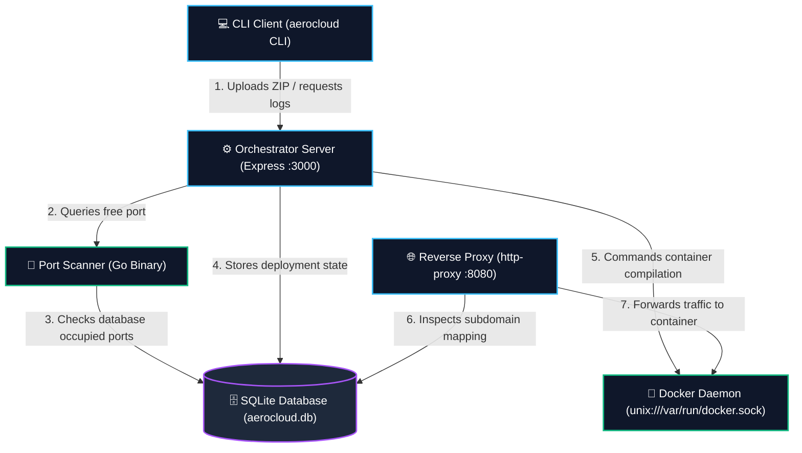
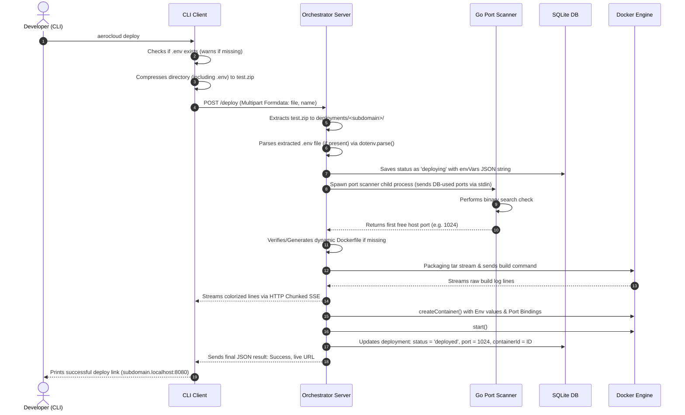

# 🗺️ AEROCLOUD ARCHITECTURE & SYSTEM FLOWS (L1 – L3)

This document is the canonical visual and logical blueprint of the AeroCloud PaaS. If you return to this codebase after 1 year, this guide will instantly rebuild your mental model of the entire system.

---

## 1. The Big Picture: System Components
Here is how the 4 main components of AeroCloud interact with your local OS and the Docker daemon:

---

## 2. End-to-End Execution Flows

### 🚀 A. Deployment Flow (`aerocloud deploy`)
This sequence diagram shows the step-by-step execution path when you trigger a deployment:

---

## 3. Core Methods & API Reference

### 1. `deploy` (Deployment & Creation)
*   **CLI Trigger:** `aerocloud deploy`
*   **HTTP Endpoint:** `POST /deploy` (accepts multipart file zip upload)
*   **Key Files:**
    *   [`cli/src/utils/archieve.ts`](file:///Users/goludhakad/Desktop/aerocloud/cli/src/utils/archieve.ts): Zips files with `dot: true` (ensuring `.env` gets packaged).
    *   [`server/src/routes/deploy.ts`](file:///Users/goludhakad/Desktop/aerocloud/server/src/routes/deploy.ts): Handles zip extraction, `.env` parsing, database entry, port scanner execution, image compiling, and container initialization.

### 2. `list` / `status` (Telemetry & Stats)
*   **CLI Trigger:** `aerocloud list`
*   **HTTP Endpoint:** `GET /list`
*   **Key Files:**
    *   [`server/src/routes/listDeployments.ts`](file:///Users/goludhakad/Desktop/aerocloud/server/src/routes/listDeployments.ts): Queries SQLite deployments.
    *   **The Logic:**
        1. Fetch all rows from the database.
        2. Loop through rows in parallel using `Promise.all()`.
        3. If container is running, query Docker daemon: `container.inspect()` to get state, and `container.stats({ stream: false })` to get raw memory bytes.
        4. Calculate RAM usage: $\text{MB} = \text{bytes} / (1024 \times 1024)$.
        5. Return unified JSON back to client.

### 3. `logs` (Real-Time App Logs)
*   **CLI Trigger:** `aerocloud logs <subdomain> [-f]`
*   **HTTP Endpoint:** `GET /deployments/:subdomain/logs?follow=true`
*   **Key Files:**
    *   [`server/src/routes/logs.ts`](file:///Users/goludhakad/Desktop/aerocloud/server/src/routes/logs.ts): Streams logs from Docker Engine.
    *   **The Logic:**
        1. Read `follow` query parameters.
        2. Set Express response headers for Server-Sent Events (SSE): `Content-Type: text/event-stream`.
        3. Fetch stream: `container.logs({ follow: true, stdout: true, stderr: true })`.
        4. **Clean Headers:** Docker prefixes logs with 8-byte binary headers. We demux it using `container.modem.demuxStream(logStream, res, res)` which streams clean text directly to Express write pipelines.
        5. **Connection Close:** Listen for `req.on('close')` to invoke `logStream.destroy()` and prevent server memory leaks when developers press `Ctrl+C`.

### 4. `stop` (Graceful Suspend)
*   **CLI Trigger:** `aerocloud stop <subdomain>`
*   **HTTP Endpoint:** `POST /stop/:subdomain`
*   **Key Files:**
    *   [`server/src/routes/stopContainer.ts`](file:///Users/goludhakad/Desktop/aerocloud/server/src/routes/stopContainer.ts)
    *   **The Logic:**
        1. Check container state via `container.inspect()`.
        2. If `State.Running` is true, invoke `container.stop()`. If it is already stopped, do nothing (preventing a Docker 304 conflict crash).
        3. Update database status to `'stopped'`.

### 5. `destroy` (Permanent Purge)
*   **CLI Trigger:** `aerocloud destroy <subdomain>`
*   **HTTP Endpoint:** `POST /destroy/:subdomain`
*   **Key Files:**
    *   [`server/src/routes/stopContainer.ts`](file:///Users/goludhakad/Desktop/aerocloud/server/src/routes/stopContainer.ts)
    *   **The Logic:**
        1. Check container state. Stop if running, then call `container.remove()`.
        2. Delete deployment database record: `deleteDeployment(subdomain)`.
        3. Delete files from disk: `fs.rmSync(targetDir, { recursive: true, force: true })` to free up space.

### 6. `Reverse Proxy` (Request Routing Gateway)
*   **Port:** `:8080`
*   **Key Files:**
    *   [`proxy/src/index.ts`](file:///Users/goludhakad/Desktop/aerocloud/proxy/src/index.ts)
    *   **The Logic:**
        1. Listens for HTTP requests.
        2. Extracts subdomain prefix from the Host header (e.g., `app-criott.localhost`).
        3. Connects to SQLite database synchronously (`DatabaseSync`).
        4. Queries DB for subdomain port.
        5. Dynamically forwards incoming HTTP stream to `http://localhost:<targetPort>` using `http-proxy`.
